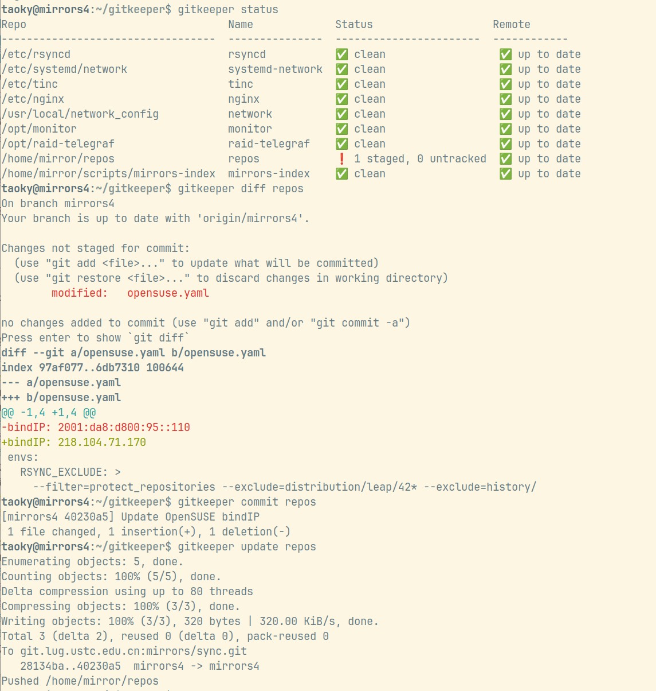

# gitkeeper

Works like etckeeper, but tracks git repos specified instead of just `/etc`.

No third-party dependencies required. Python >= 3.8 (as the one for Ubuntu 20.04). It's expected for this script to run in supported Ubuntu LTS and Debian (5 years, ESM and ELTS excluded).

## Install

```shell
sudo wget https://github.com/taoky/gitkeeper/raw/master/gitkeeper -O /usr/local/bin/gitkeeper
sudo chmod +x /usr/local/bin/gitkeeper
```

And then create `/etc/gitkeeper.conf` with repos you need to track.

If you're using bash, you could download the completion script:

```shell
sudo wget https://github.com/taoky/gitkeeper/raw/master/completions/gitkeeper.completion.bash -O /etc/bash_completion.d/gitkeeper
```

## Help

```console
$ gitkeeper help
usage: Track git repos [-h] [--config CONFIG] [--parallel PARALLEL] {status,commit,update,vcs,ls,diff,help} ...

positional arguments:
  {status,commit,update,vcs,ls,diff,help}
    status              Show status of repo(s)
    commit              Add all and commit changes in repo(s) on behalf of current user
    update              Push/pull repo(s) with remote
    vcs                 Run a git command on repo(s)
    ls                  Just list all repos
    diff                Show changes in given repo
    help                Show help

options:
  -h, --help            show this help message and exit
  --config CONFIG, -c CONFIG
                        Path to config file
  --parallel PARALLEL, -p PARALLEL
                        Threads to use for status and update commands
```

`PARALLEL` defaults to 8.

A special name, `.`, could be used to represent the current directory repo if it exists in config file. This means that you could set `alias gitk="gitkeeper vcs ."` and enjoy `gitk` same as how you use `git` before.

## Example



## Finding all git repos

```bash
sudo find / -name .git -type d -xdev 2>/dev/null
```

## Config example

### `/etc/gitkeeper.conf`

```ini
[rsyncd]
path = /etc/rsyncd

[systemd-network]
path = /etc/systemd/network

[repos]
path = /home/mirror/repos
user = mirror
```

By default gitkeeper would try to get the owner of specified folder and use it as the user to run git. You can specify a user in the config file to override this.

### `~/.gitkeeper.conf`

```ini
[user]
email = me@example.com
name = example
```

Gitkeeper would ask your email if the file does not exist, and use username as name. You could override them in the config file. If `~/.gitkeeper.conf` does not exist, gitkeeper would try reading `~/.gitconfig` to see if `user.email` is set, and use it and `user.name` (or username).

Note that if you use `sudo` to run gitkeeper, it would still use the config file in the home directory of the user (instead of root) who runs it.

## Practice of SSH deploy key

Gitkeeper would not try to push repositories when it has a HTTP(S) remote (as you need to type in password/code in most cases). So you might what to use SSH deploy key.

However, GitHub does not support to use a same deploy key for multiple repositories. In this case you can create a deploy key for each repository:

1. Create a SSH key pair inside the `.git` directory of the repository.

    ```bash
    cd .git
    # RSA key pair
    ssh-keygen -f ./id_rsa -t rsa -b 4096 -N ""
    # or ED25519 key pair
    ssh-keygen -f ./id_ed25519 -t ed25519 -N ""
    ```

2. Update `.git/config` like this:

    ```ini
    [core]
        # ...
        # RSA key pair
        sshCommand = ssh -i .git/id_rsa
        # or ED25519 key pair
        sshCommand = ssh -i .git/id_ed25519
    ```

3. Add public key (`id_rsa.pub` or `id_ed25519.pub`) to the repository's deploy keys.
